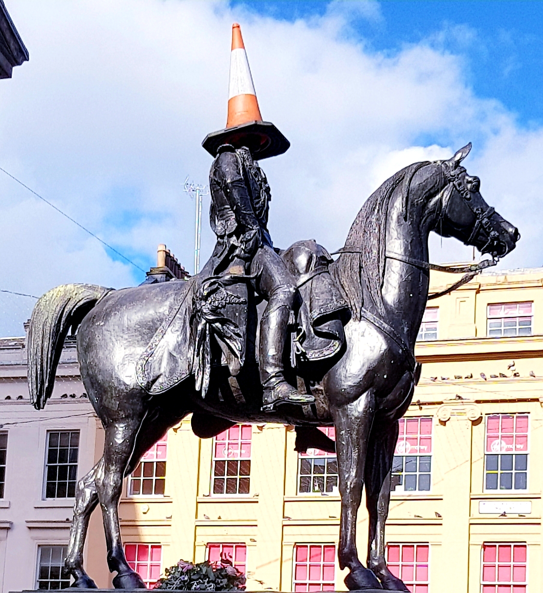

 <b/>

 <b/>
 <b/>


# Capstone Project
This Repository contains a data science project completed using data collected with the Foursquare API and several publically available data sets from the local city council and UK royal mail. This is an ongoing project. This is aims to provide data based insight to new businesses in Glasgow.  It aims to provide insight on the optimum venues within Glasgow that 
* Are within 5 km of the city center 
* Have good transpost accessibility (are within 2 km of a Subway station) 
* Have a high population density 
* and also a high diversity demographic profile. 

It also aims to provide insight on popular venues around a location for competition analysis around the shortlisted postcode locations.

The main code of the project is saved in the Jupyter notebook.

[The Jupyter Notebook](https://github.com/RabiyaF/Coursera_Capstone/blob/master/Glasgow_Project_Notebook.ipynb)

The Report: Coming Soon!

The Presentation: Coming Soon!

The Blog: Coming Soon!


The follwing libraries were used to build the code
```
Pandas - For data frame import, manupilutaion and wrangling 
BeautifulSoup - For Webscraping
Nominatim- from geopy.geocoders to obtain location coordinate data  
folium- for plotting and visualizing geographical data
Matplotlib- For population and demographic data visualization
FourSquarAPI- For obtaining venues information
```
