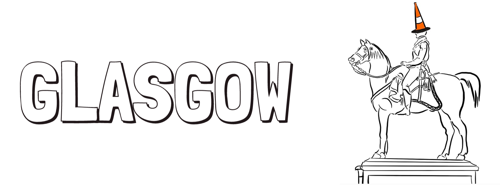
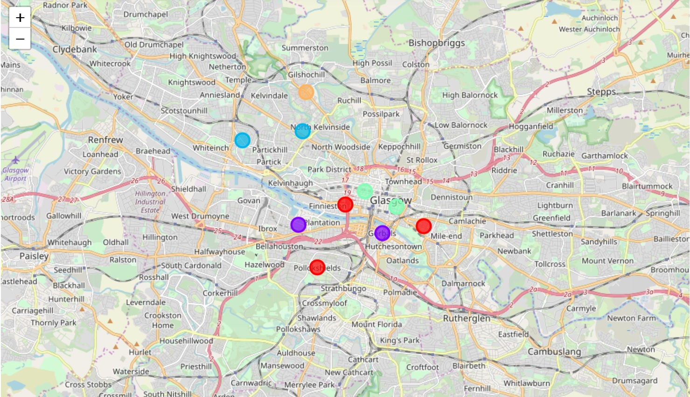
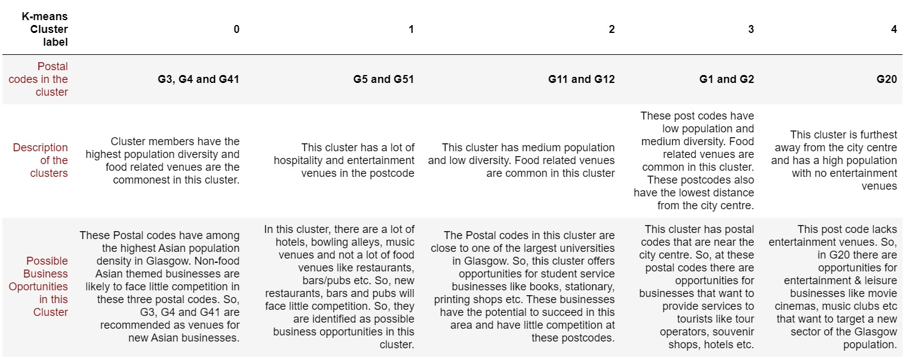

 

## Overview of Project

In this Project, publicly available datasets from the Glasgow City Council and the Royal Mail are used alongside data collected from the FourSquareAPI in order to obtain data driven insight into possible business opportunities in Glasgow and the best venues for those opportunities. The project is divided into 4 stages.

### <span style="color:navy">In Stage 1-</span> 
Data of all the post codes in Glasgow is scraped from the wikipedia website and saved into a data frame. This results in a dataframe with 56 postal codes. The data is then cleaned to remove non-geographical post codes. After the data processing the post codes are reduced to 50 valid entries. For each of the postal code addresses, the latitude and longitude are determined using the foursquareAPI. The 50 postal codes are further shortlisted based on two criteria which are distance to the city centre and the distance to the nearest subway station. For this analysis post codes within 5 km of the city centre and within 2 km of the nearest subway station are considered. In order to determine the distance between the city centre and a given post code, the **Haversine formula** is used. The same is done to find the distance between a postal code and the nearest subway station. Based on the distance criteria specified above, the final post code list is reduced to 10 post codes. 

| Shortlisted Post codes |      
| :---:                     | 
| G1 |
|G2|
|G3|
|G4|
|G5|
|G11|
|G12|
|G20|
|G41|
|G51|


### <span style="color:navy">In Stage 2-</span> 
Publicly available data sets are used to determine the population at each of the 10 shortlisted postcode along with population diversity. A direct dataset to map postal codes to population is not available. Therefore, two datasets were used to extract this information. The [Royal Mail Data set](http://www.glasgow.gov.uk/CHttpHandler.ashx?id=16002&p=0) maps Postal codes to Datazones and the [Glasgow City Council Data Set](https://data.glasgow.gov.uk/dataset/national-identity-by-ethnic-group-2011-census) maps datazones to population information. The information is extracted using both dataset and visualized.

### <span style="color:navy">In Stage 3-</span>
In this stage, the venues in each postcode are extracted using the FourSquaresAPI. This is done in order to perform a competition analysis at each postcode and identify possible opportunities at these locations. The centre of postcodes are the latitude and longitude determined in stage 1. A search area of 1.5 km around that centre is defined. 100 venues are requested from each of the locations. The data set is processed to remove repeating entries. There are ≈ 420 business venues in the 10 shortlisted postcodes given above in Glasgow.

### <span style="color:navy">In Stage 4-</span>
In this stage of the project, the ≈ 420 venues obtained in stage 3 are processed. There are 114 unique venue categories. They are one hot encoded. Then the top five venues are found in each postal code. These Top five venues are saved in a dataframe and then merged with the data frame containing the population data. It is then feed into a k-mean clustering algorithm (unsupervized learning) in order to classify the postal codes into 5 distinct categories. The clusters are then colour coded and plotted on a Map below.

 

| Cluster |  0    | 1     | 2     | 3     | 4     |
| :---:   | :---: | :---: | :---: | :---: | :---: |
| Color on map| Red | Purple | Blue | Green | Orange | 
| Postal Codes in Cluster| G3, G4 and G41 | G5 and G51 | G11 and G12 | G1 and G2 | G20 | 

### <span style="color:navy">Results and Discussion-</span>
A summary of the cluster label results from the K-means algorithm is given in the table below. Based on the similarity of the postal codes, cluster descriptions are defined along with the identification of possible business opportunities in each cluster.   

 


### <span style="color:navy">Conclusion-</span>
This project uses publicly available datasets and the FourSquareAPI to provide businesses insights and recommendations about the best venues within Glasgow to set up various businesses based on opportunities identified using the application of data analysis and Machine learning.  

[The Jupyter Notebook](https://github.com/RabiyaF/Coursera_Capstone/blob/master/Glasgow_Capstone.ipynb)

[The Report](https://github.com/RabiyaF/Coursera_Capstone/blob/master/Week%205/Final%20Report.pdf)

[The Presentation](https://github.com/RabiyaF/Coursera_Capstone/blob/master/Week%205/Presentation.pdf)

The follwing libraries were used to build the code
```
Pandas - For data frame import, manupilutaion and wrangling 
BeautifulSoup - For Webscraping
Nominatim- from geopy.geocoders to obtain location coordinate data  
folium- for plotting and visualizing geographical data
Matplotlib & Seaborn- For population and demographic data visualization
FourSquarAPI- For obtaining venues information
SciKit Learn- For Implementing K-means Algorithm
NumPy- for multi-dimentional array and matrix data structures 
```
